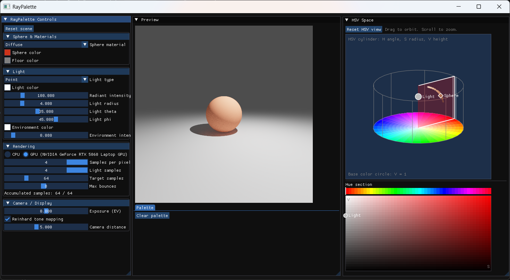

# RayPalette

RayPalette は、制御した照明下でイラストの色がどのように変化するかを
検討するための軽量な CUDA レンダラーです。
シンプルな球と床のシーンの材質設定をGUIで対話的に調整できます。

## 1. 前提条件

### 1.1. 共通

- CMake 3.24 以降
- C++17 コンパイラ
- clang-format 14 以降（ソース整形を行う場合）
- NVIDIA CUDA Toolkit 12.8 以降（GPU版をビルドする場合のみ）
- GPU版を使わない場合は、CUDA ToolkitとNVIDIA GPUは不要

### 1.2. Ubuntu 24.04（確認済み）

- GCC 13.3
- NVIDIA CUDA Toolkit 12.8.93
- GLFW/OpenGL GUI 用 X11・OpenGL 開発パッケージ

```sh
sudo apt install libgl1-mesa-dev libxrandr-dev libxinerama-dev libxcursor-dev libxi-dev
```

- clang-format

```sh
sudo apt install clang-format
```

### 1.3. Windows 11（CPU版GUI確認対象）

- Visual Studio Community 2026 または Build Tools 2026
- 「C++ によるデスクトップ開発」ワークロード、MSVC、Windows SDK
- clang-format（Visual Studio LLVM toolsまたはLLVM公式パッケージ）
- NVIDIA CUDA Toolkit 12.8 以降（GPU版をビルドする場合のみ）
- OpenGLはWindows標準の`opengl32`を使用します。GLFWとDear ImGuiはCMakeが取得します。

## 2. 構成とビルド

### 2.1. Ubuntu 24.04（確認済み）

- UbuntuではGUI用presetを使用して構成、ビルド、テストを実行します。X11/OpenGL開発
パッケージをインストールしてください。初回の構成ではFetchContentによる依存ライブラリ
のダウンロードが発生します。

```sh
# GPU
cmake --preset linux-debug
cmake --build --preset linux-debug
ctest --preset linux-debug --output-on-failure
./build/linux-debug/raypalette

# CPU
cmake --preset linux-cpu-debug
cmake --build --preset linux-cpu-debug
ctest --preset linux-cpu-debug --output-on-failure
./build/linux-cpu-debug/raypalette
```

### 2.2. Windows 11

Visual Studio 2026 の「Developer PowerShell for VS 2026」または同等の開発用
コマンドプロンプトから実行します。初回の構成ではFetchContentによる依存ライブラリの
ダウンロードが発生するため、ネットワーク接続が必要です。

ローカルではVisual Studioジェネレーターのpresetを使用します。GitHub Actionsでは
Visual Studioのバージョンに依存しないよう、MSVC開発環境を自動検出してNinjaで同じ
CPU + GUI構成をビルドします。

```powershell
# CPU
cmake --preset windows-cpu-debug
cmake --build --preset windows-cpu-debug
ctest --preset windows-cpu-debug --output-on-failure
.\build\windows-cpu-debug\Debug\raypalette.exe

# GPU
cmake --preset windows-debug
cmake --build --preset windows-debug
ctest --preset windows-debug --output-on-failure
.\build\windows-debug\Debug\raypalette.exe
```

CPU版のRelease配布exeを作成する場合は、Git Bashから次を実行します。ビルドとCTestが
成功した後、`dist/windows-cpu-release/raypalette.exe`へコピーされます。
配布ビルドはMSVCランタイムを静的リンクするため、Visual C++ Redistributableの別途
インストールは不要です。Windows標準のOpenGL・Win32 DLLは使用します。

```sh
bash scripts/package_windows_cpu.sh
```

GPU版のRelease配布exeは、CUDA Toolkitと対応GPUがある環境で次を実行します。ビルドと
CTestが成功した後、`dist/windows-gpu-release/raypalette.exe`へコピーされます。MSVC
ランタイムとCUDA runtimeは静的リンクされるため、別途DLLを同梱する必要はありません。
利用者側にはRTX 50シリーズ対応のNVIDIAドライバが必要です。

```sh
bash scripts/package_windows_gpu.sh
```

整形チェックを行う場合、Visual Studio InstallerでLLVM toolsを追加するか、LLVM公式
パッケージをインストールします。Visual Studioに同梱された`clang-format.exe`はCMakeが
標準配置から自動検出します。

```powershell
cmake --build build/windows-cpu-debug --target format-check
cmake --build build/windows-cpu-debug --target format
```

## 3. コード整形

### 3.1. Ubuntu 24.04（確認済み）

Ubuntuでは`clang-format`をインストールしてから、任意のビルドディレクトリで
整形または整形チェックを実行します。C++とCUDAのソースが対象です。

```sh
cmake --build build/linux-debug --target format        # 修正
cmake --build build/linux-debug --target format-check  # 検査
```

`format`はファイルを直接更新し、`format-check`は差分がある場合に失敗します。
整形設定は[.clang-format](.clang-format)にあります。既存ファイルの一括整形は
意図しない大きな差分になり得るため、導入時には変更内容を確認してください。

## 4. テスト

テストは CTest に登録されています。構成とビルドを完了した後、次のコマンドで
すべてのテストを実行します。

### 4.1. Ubuntu 24.04（確認済み）

```sh
ctest --preset linux-debug --output-on-failure
ctest --preset linux-cpu-debug --output-on-failure
```

特定のテスト群だけを実行する場合は、`-R` に正規表現を指定します。

```sh
ctest --preset linux-cpu-debug -R Vec3 --output-on-failure
```

現在は、ベクトル・色・極座標のGoogleTest unit testとCPU Renderer testを実行します。
CUDA版では加えて、共有数学ヘッダを`nvcc`で検査するCUDAコンパイルチェックと、
GPU Renderer testを実行します。CUDAコンパイルチェックはビルド時に実行され、
CTestのテスト一覧には含まれません。

### 4.2. Windows 11

CPU版は`windows-cpu-debug`または`windows-cpu-release`、GPU版は`windows-debug`または
`windows-release`のpresetを使用します。Visual Studioジェネレーターでは構成がビルド
ディレクトリ名に含まれるため、実行ファイルは`build/<preset>/Debug`または
`build/<preset>/Release`に生成されます。

## 5. 依存ライブラリ

Dear ImGui、GLFW、GoogleTest は、CMake の `FetchContent` を通じて
`cmake/Dependencies.cmake` に不変の上流コミット SHA で定義しています。
実装済みターゲットで `RAYPALETTE_FETCH_DEPENDENCIES=ON` を有効にした場合にのみ
ダウンロードされます。初回のダウンロードにはネットワーク接続が必要ですが、
以降は CMake がビルドツリー内に展開したキャッシュを再利用します。Ubuntu では、
先に上記の GUI 用パッケージをインストールしてから有効にしてください。

## 6. 実行結果

左の`RayPalette Controls`画面でシーンの設定を行うと、その結果は逐次右の`Preview`画面へと反映されます。
また`Preview`画面でマウスをクリックするとその下側の`Palette`タブにそのuv位置の色を追加します。
`Palette`に追加された各色のHEXコードを選択して`Ctrl+C`を行うことで貼り付けすることが可能です。
この`Palette`上の色はシーンの設定を変えるたびにリセットされます。
また光源によって固有色がHSV色空間上でどのように変化するか？を右の`HSV Space`画面で3Dプロットとして確認できます。

- 